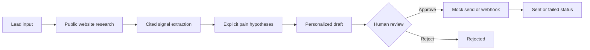
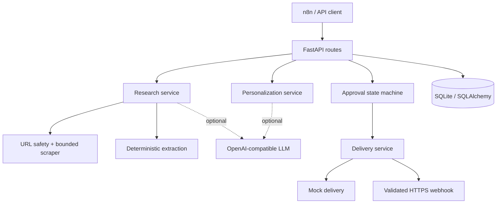

# OutreachPilot

OutreachPilot is a portfolio-grade FastAPI service for evidence-grounded B2B account research and personalized outreach drafting. It demonstrates the workflow an AI GTM engineer might automate while keeping the consequential step—sending a message—under explicit human control.

> OutreachPilot is not a bulk email sender. It never sends an unapproved draft, and its default delivery mode only records a mock send.

## Problem

Revenue teams often copy company facts from public websites, infer whether an account is relevant, and rewrite similar first-touch messages. Fully autonomous outreach makes this faster at the cost of factual quality, control, and trust.

## Solution

OutreachPilot collects bounded public-website evidence, turns it into cited signals, labels inferred pains as hypotheses, and creates a concise draft. A person must approve or reject each draft before delivery. REST endpoints and webhook-shaped JSON make the workflow easy to orchestrate from n8n or a CRM.



## Architecture



The deterministic path works without an API key. An optional OpenAI-compatible provider can improve hypotheses and copy, but structured responses are validated and safely fall back when generation fails. See [docs/ARCHITECTURE.md](docs/ARCHITECTURE.md).

## Features

- Public website research with timeouts, retry, response-size limits, and SSRF protection
- Cited signals containing a name, evidence excerpt, source URL, and confidence
- Pain statements explicitly labeled as hypotheses
- Short personalized drafts using configurable positioning
- Enforced `awaiting_approval → approved/rejected → sent/failed` workflow
- Safe mock delivery by default; optional outbound HTTPS webhook
- Inbound webhook designed for n8n, with automatic processing disabled by default
- Typed OpenAPI documentation, SQLite persistence, Docker, pytest, Ruff, and strict mypy

## Quick start

Python 3.11+ is required.

```bash
python -m venv .venv
source .venv/bin/activate
pip install -e '.[dev]'
cp .env.example .env
uvicorn app.main:app --reload
```

Open `http://localhost:8000/docs` for the interactive API. The app creates its local SQLite tables on startup. No LLM key is required.

## API example

Create a contact:

```bash
curl -X POST http://localhost:8000/contacts \
  -H 'Content-Type: application/json' \
  -d '{
    "first_name": "Sarah",
    "last_name": "Kim",
    "email": "sarah@example.com",
    "role": "VP of Sales",
    "company_name": "Example Company",
    "company_website": "https://example.com"
  }'
```

Run research, generate a draft, review it, then explicitly approve and send:

```bash
curl -X POST http://localhost:8000/contacts/1/research
curl -X POST http://localhost:8000/contacts/1/draft
curl http://localhost:8000/contacts/1/draft
curl -X POST http://localhost:8000/drafts/1/approve
curl -X POST http://localhost:8000/drafts/1/send
```

`POST /drafts/1/send` returns HTTP 409 for `draft`, `awaiting_approval`, or `rejected` records. A sent draft also cannot be sent again.

## Human-in-the-loop safety

Draft generation ends at `awaiting_approval`. There is no configuration that automatically approves or sends a message. Approval and rejection are explicit endpoints with guarded state transitions. Even `WEBHOOK_AUTO_PROCESS=true` only runs research and creates a draft—it still stops for review. Delivery defaults to `mock`; webhook delivery requires an explicit mode and a public HTTPS destination.

## Example outreach

> **Subject:** A research workflow for Acme Health  
> Hi Sarah,  
> I noticed Acme Health's website highlights a demo-led sales motion.  
> Given your role as VP of Sales, your team may be spending meaningful time researching and qualifying accounts before sales conversations.  
> We help revenue teams automate evidence-based account research and qualification so reps can spend more time in conversations.  
> Would it be useful if I sent over a short example?  
> Best,  
> Alex

The actual draft is grounded in the signals extracted for that contact. If evidence is sparse, the fallback says so instead of inventing detail.

## n8n integration

Call `POST /webhooks/outreach` from an n8n HTTP Request node, or expose that endpoint directly behind your own ingress. A human approval node should call `/approve` or `/reject`; only the approved branch calls `/send`. Exact node requests and an importable starter workflow are in [docs/N8N_WORKFLOW.md](docs/N8N_WORKFLOW.md) and [examples/outreachpilot-n8n-workflow.json](examples/outreachpilot-n8n-workflow.json).

## Configuration

Copy `.env.example` and adjust values. Key options are:

| Variable | Default | Purpose |
|---|---|---|
| `LLM_API_KEY` | empty | Enables optional OpenAI-compatible generation |
| `LLM_BASE_URL` / `LLM_MODEL` | OpenAI / `gpt-4o-mini` | Provider and model selection |
| `VALUE_PROPOSITION` | generic GTM automation copy | Positioning inserted in messages |
| `DELIVERY_MODE` | `mock` | `mock` or `webhook` |
| `OUTBOUND_WEBHOOK_URL` | empty | Public HTTPS endpoint for approved messages |
| `WEBHOOK_AUTO_PROCESS` | `false` | Research and draft after inbound webhook; never approve/send |

Never commit `.env`; it is ignored by Git.

## Docker

```bash
docker compose up --build
```

The API is exposed on port 8000 and persists SQLite data in a named volume.

## Quality checks

```bash
pytest
ruff check .
ruff format --check .
mypy app --strict
```

## Example data

Two fictional, safe payloads are provided in [examples/leads.json](examples/leads.json). Replace their websites with a public site you are authorized to research for a live demonstration.

## Limitations

- The crawler intentionally checks only the home page and a few conventional public paths; it is not a general web crawler.
- Keyword extraction is explainable but deliberately modest. LLM output still requires human judgment.
- SQLite and in-process tasks suit a local portfolio demo, not high-throughput production workloads.
- There is no authentication, CRM-specific adapter, queued worker, or email-provider integration by design.
- Website terms, robots guidance, privacy obligations, and applicable outreach laws remain the operator's responsibility.

## Future improvements

- Respect and surface `robots.txt` directives and per-domain rate limits
- Add CRM adapters with idempotency keys and audit events
- Add background jobs for slow research while preserving approval gates
- Evaluate extraction precision and message faithfulness against a labeled fixture set
- Add editable drafts and approval notes

## Screenshots

Add portfolio screenshots here after running the demo:

- Swagger overview (`/docs`)
- Evidence-rich research response
- Blocked unapproved send (HTTP 409)
- Approved mock-send response

## Interview demo

Follow the concise [2–3 minute demo script](docs/DEMO.md).

