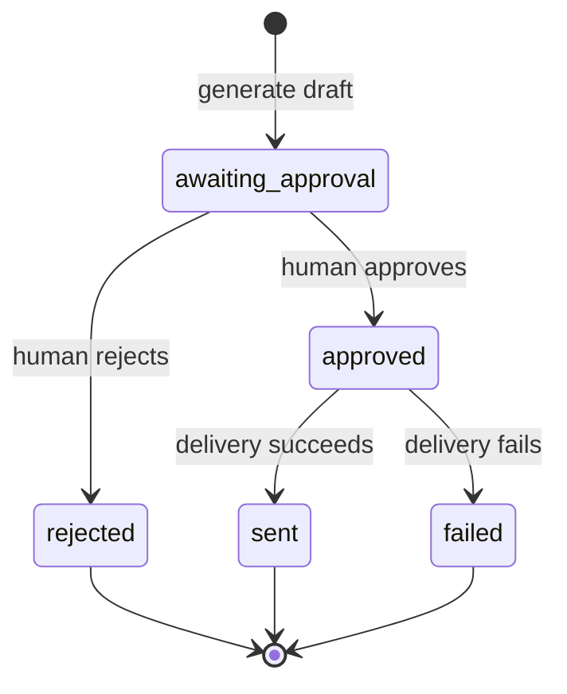

# Architecture

OutreachPilot is a single FastAPI service organized around a small set of domain services. This keeps the demo easy to run while making the policy boundaries visible.

## Request path

1. `api.py` validates HTTP payloads and resolves database records.
2. `url_safety.py` rejects credentials, unsupported schemes, localhost, and any address that resolves to a private, loopback, reserved, or link-local network.
3. `scraper.py` fetches bounded HTML with a timeout and one retry. Redirects are not followed, avoiding redirect-based SSRF bypasses.
4. `extraction.py` turns literal website text into cited, confidence-scored signals.
5. `research.py` persists research and generates cautious hypotheses. The deterministic fallback maps only known signals to templated hypotheses.
6. `personalization.py` builds a draft from contact data, signals, a hypothesis, and configured positioning. Drafts always begin in `awaiting_approval`.
7. `approval.py` owns allowed state transitions. `delivery.py` independently asserts approval before mock or webhook delivery.

## State machine

The model includes `draft` to support future editable records, but generated messages move directly to `awaiting_approval`. Sending checks for exactly `approved`, so every other state is denied.

## LLM boundary

The OpenAI-compatible client is optional and only accepts validated JSON outputs. Research inputs contain the collected signals rather than an open-ended invitation to invent company facts. Hypothesis outputs must retain a hypothesis label, cite one of the known source URLs, and overlap with source evidence; otherwise deterministic output is used. Drafts over 120 words also fall back.

## Security boundaries

- DNS is resolved before requests and every resolved address must be public.
- HTTP scraping permits public HTTP/HTTPS; outbound delivery requires HTTPS.
- Embedded URL credentials and non-HTTP schemes are rejected.
- Scraping enforces content type, maximum response bytes, and timeout.
- The service parses HTML but does not execute scripts or user code.
- Secrets are environment-only and `.env` is ignored.
- No API route can combine approval and send.

For production, re-resolve at connection time or pin the validated IP to defend fully against DNS rebinding, add authentication and authorization, persist immutable audit events, and use a controlled egress proxy.

